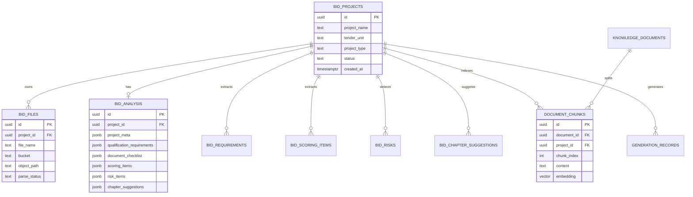

# 清江峡能精密制造 AI 标书系统

基于大语言模型 (LLM) 与检索增强生成 (RAG) 技术的内网智能标书编制系统。本项目面向湖北恩施清江峡能精密制造厂，围绕三峡集团及相关水电装备供应链业务，覆盖水轮机叶片、专用螺母、紧固件、金属结构件、设备配套加工、质量检验、交付保障和现场服务等投标场景，通过结合本地知识库高精度检索与大模型文本生成能力，实现招投标文件的自动化分析、撰写、排版、在线编辑与导出。

> 本项目为清江峡能精密制造厂内网部署的 AI 标书系统，核心链路包括招标文件解析、企业知识库检索、投标章节设计、投标正文生成、Word 排版导出与 OnlyOffice 在线编辑。

---

## 🛠️ 技术栈 (Tech Stack)

* **核心语言:** Python 3.9+
* **后端 Web 框架:** Flask + Flask-CORS，详见 `main.py` 与 `routes.py`
* **前端当前实现:** Vite + React 18 + TypeScript 组件化工程，源码位于 `frontend/`
* **前端页面形态:** 单机版后台工作台，包含顶部栏、左侧导航、首页 Banner、智能标书入口、基础工具、最近任务、知识库状态、标书生成流程和 AI 助手浮窗
* **前端 UI 组件:** Ant Design 5 + Tailwind CSS + lucide-react
* **前端路由:** React Router
* **前端服务端状态:** TanStack Query
* **前端全局状态:** Zustand
* **前端请求体验:** Axios 拦截器 + Zustand 请求计数 + Ant Design Spin，统一 API 请求会在当前内容区域展示 Loading，不遮挡固定 Header、侧边栏和 Footer
* **前端编辑器预留:** TipTap，用于后续章节正文编辑器能力
* **前端接口调用:** Axios + FormData，直接调用 `/api/users/*`、`/api/bidding/*`、`/api/outputs/*`
* **前端资源管理:** `frontend/public/assets/` 与 Vite 构建资源，生产环境由 Flask `/assets/<filename>` 路由托管
* **在线文档编辑前端集成:** 现阶段 Word 生成和下载已接入；OnlyOffice 在线编辑配置仍由后端生成，后续放入 React 编辑器页
* **大语言模型:** 通义千问 (Qwen)
* **在线数据库:** Supabase PostgreSQL，作为后续招标解析、文件元数据、结构化结果、任务记录的主数据库
* **向量能力:** Supabase PostgreSQL + pgvector；当前 ChromaDB 仍作为本地向量库兼容保留
* **对象存储:** Supabase Storage，用于招标文件、生成 Word、知识库文件、资信文件和产品资料
* **本地兼容数据库:** SQLite，现有 MVP 接口仍保留，后续逐步迁移到 Supabase
* **文档处理:** `python-docx` / Markdown 解析库

### 在线编辑器架构建议

针对招投标标书“字体、字号、行距、页边距、页码、分页、分节、表格版式必须严格合规”的特点，当前建议采用 **双编辑器分层架构**，而不是只依赖单一富文本编辑器：

```text
AI 标书编制工作台（React / TipTap 或 Umo 类中文编辑层）
  ↓
章节生成 / AI 改写 / 资料引用 / 风险校验 / 结构化编辑
  ↓
Markdown / 结构化章节数据
  ↓
python-docx 生成标准 DOCX
  ↓
ONLYOFFICE Docs 作为最终定稿编辑器
  ↓
DOCX / PDF 导出交付
```

该架构的核心原则：

* **AI 工作台** 负责章节树、AI 生成、资料引用、审阅和结构化写作体验。
* **ONLYOFFICE** 负责最终版式合规、页眉页脚、页码、分节、表格、打印结果和 DOCX 定稿。
* 不建议仅依赖 TipTap/Umo 一类富文本编辑器直接承担最终投标文件的格式合规责任。

推荐的数据链路：

```text
招标文件解析
→ AI 解读
→ 章节大纲生成
→ 单章节正文生成
→ 工作台人工修订
→ 生成标准 DOCX
→ ONLYOFFICE 在线终稿校对
→ 导出 PDF / DOCX
```

推荐的页面职责拆分：

* `/bid-editor`：AI 标书编制工作台，负责章节树、正文生成、资料插入、结构化审阅。
* `/outputs/<doc>.docx`：标准 DOCX 产物。
* ONLYOFFICE 编辑页：负责最终在线排版、格式校验、下载与打印。

后续实施建议：

* 当前阶段保留 `/bid-editor` 作为 AI 工作台。
* 后续引入 TipTap 或 Umo，只承接“编写层/审阅层”，不直接替换终稿编辑器。
* 终稿交付仍以 `DOCX + ONLYOFFICE` 为主链路。

### 在线编辑器选型调研结论

#### 1. ONLYOFFICE Docs

定位：**最终定稿编辑器首选**

适合原因：

* 属于在线 Office 文档引擎，不是普通富文本框架。
* 更适合承接 `DOCX` 主格式和强版式场景。
* 能覆盖页面大小、页边距、方向、分页、分节、页眉页脚、行距、段前段后、表格等终稿排版能力。
* 更适合投标文件、正式公文、对外交付材料。

不足：

* 不是 100% 等同 Word/WPS，复杂历史文档仍可能存在兼容差异。
* 部署和集成相对较重。

结论：

* **当前项目应继续保留 ONLYOFFICE 作为最终在线编辑器。**

#### 2. Collabora Online

定位：**办公套件备选**

适合原因：

* 同样属于在线 Office 套件路线。
* 支持私有化部署和常见 Office 文档格式。

不足：

* 在国内中文投标场景下，体验和接受度通常不如 ONLYOFFICE。
* 不建议优先于 ONLYOFFICE 使用。

结论：

* 可作为备选，不作为当前首选路线。

#### 3. Umo Editor / Umo Editor Next

定位：**中文写作工作台候选**

适合原因：

* 中文体验好，产品感强，更贴近国内用户习惯。
* 支持类 Word 分页、页面大小、页边距、打印、内网部署。
* 很适合做“AI 写作层”“中文工作台层”。

限制：

* 开源版基于 Vue3 + Tiptap3，当前 React 项目若接入，通常需要 iframe 或独立子应用方式。
* 更强的导入导出、协作、评论等能力主要在 Next 版本，属于商业路线。
* 不建议单独承担最终投标格式合规责任。

结论：

* **适合作为中文 AI 编写工作台候选，不适合作为唯一终稿编辑器。**

#### 4. TipTap 及基于 TipTap 的二开方案

定位：**AI 结构化写作层首选框架**

适合原因：

* React 集成最好，定制能力最强。
* 适合实现章节写作、AI 续写、批注、审阅、知识库引用、自定义组件。
* 很适合作为当前 `/bid-editor` 的下一阶段富文本内核。

限制：

* 本质上是编辑框架，不是成熟的 Office 文档排版引擎。
* 页面对齐、分页、打印一致性、DOCX 最终兼容性，不适合作为投标终稿唯一保障。

结论：

* **适合作为 AI 工作台的主编辑框架，不适合作为最终标书定稿引擎。**

### 当前编辑器选型建议

综合当前项目形态，建议如下：

```text
AI 编写工作台层：
  TipTap 或 Umo Editor

最终定稿层：
  ONLYOFFICE Docs

导出交付层：
  DOCX / PDF
```

换句话说：

* **AI 生成、章节编辑、知识库引用、结构化写作** 用 TipTap / Umo。
* **最终格式合规、终稿排版、导出交付** 用 ONLYOFFICE。

这是当前最稳、也最符合中文招投标业务的路线。

### 前端技术框架说明

当前版本定位为 **企业单机部署版 MVP**，前端已按 `AI标书系统前端技术选型建议.md` 迁移为 Vite + React + TypeScript 组件化工程：

```text
frontend/
→ Vite 构建与开发服务
→ React 组件化页面
→ Ant Design 负责表格、按钮、上传、步骤条、消息提示等企业级组件
→ Tailwind CSS 负责固定布局、工作台卡片、首页视觉样式
→ React Router 保留后续多页面扩展能力
→ TanStack Query 作为服务端状态基础设施
→ Zustand 管理 AI 助手、最近任务和全局请求 Loading 等轻量状态
→ Axios 封装后端 API 调用，并通过请求/响应拦截器统一控制 Loading
```

当前采用的前端技术框架如下：

```text
React 18
Vite
TypeScript
Ant Design 5
Tailwind CSS
React Router
TanStack Query
Zustand
TipTap
lucide-react
```

前端构建产物输出到 `frontend/dist/`。后端 `main.py` 会优先托管该目录下的 `index.html` 和 Vite 静态资源；未构建时，访问 `/bidding` 会提示先执行前端构建。

### 已完成前端任务

* 已完成 Vite + React + TypeScript 前端工程迁移。
* 已完成首页工作台、左侧菜单、顶部 Header、底部 Footer 固定布局。
* 已完成企业知识库、企业资信库、企业产品库、系统设置页面。
* 已清理前端演示 Mock 数据，支持进入真实上传与解析测试。
* 已新增内容区请求 Loading：所有通过 `frontend/src/api/client.ts` 发起的请求均会自动显示处理中状态，避免上传、解析、生成等长耗时操作无反馈，同时不遮挡固定 Header、侧边栏和 Footer。
* 已新增招标解读页原文溯源：要求条款、风险项、评分项、原文分片和 AI 报告重点项均可查看页码、章节、直接依据和同页 MinerU 分片。
* 已优化 AI 深度解读展示结构：按一页式摘要、项目关键信息、关键节点、资格核查、评分策略、废标风险、编制建议、材料清单和下一步动作分区展示。
* 已新增标书章节大纲生成：基于招标解读结果生成投标文件章节目录、章节目标、响应要点、关联要求、评分/风险映射、准备资料和写作注意事项。
* 已新增标书编制工作台 `/bid-editor`：作为全屏核心编制页面独立于系统主菜单和主布局，提供左侧章节树、正文模式/目录模式、章节搜索、新增章节、仿 Office 中文工具栏和右侧正文编辑画布。
* 已将章节层级生成改为 **AI 灵活层级模式**：不再固定只生成一级或二级目录，支持按招标文件复杂度动态输出 1~4 级章节；前端目录树与目录模式按 `level` 自动缩进展示。

## 📁 核心目录结构

```text
ai_bidding/
├── main.py                # 后端服务入口文件
├── routes.py              # 核心业务路由及 API 接口定义
├── users.py               # 用户认证与权限管理模块
├── qwen_client.py         # 大模型 API 封装与调用链路
├── file_to_chroma.py      # 知识库文档解析与 Chroma 向量化持久化
├── md_to_word.py          # Markdown 转 Word (.docx) 排版导出引擎
├── frontend/              # Vite + React + TypeScript 前端工程
│   ├── src/               # 前端源码，按 api/components/pages/stores/types/utils 拆分
│   ├── public/assets/     # 前端公共静态资源
│   └── dist/              # npm run build 后生成的生产构建产物
├── bidding_workbench.html # 旧版静态工作台页面，当前生产入口已切换到 frontend/dist
├── assets/                # 后端静态资源兜底目录
├── chroma_db/             # ChromaDB 向量数据库本地存储目录
├── bidding.db             # SQLite 关系型数据库文件
└── .env                   # 环境变量与敏感配置 (API Keys 等)
```

# AI招投标项目使用说明

## 💻 环境依赖与前置软件 (Prerequisites)

为了完整运行本项目，你需要在本地或服务器上安装以下基础软件：

* Python 3.9+
* Docker（用于部署 ONLYOFFICE 和独立的向量数据库服务）

## 🐳 Docker 部署必需服务

### 1. 部署 ONLYOFFICE 文档服务器 (必须)

系统依赖 ONLYOFFICE 实现文档的在线预览和编辑。请运行以下命令启动服务（此处传入的 `JWT_SECRET` 必须与下方 `.env` 配置文件中的保持一致）：

```bash
docker run -i -t -d -p 80:80 \
  --restart=always \
  -e JWT_SECRET=fsdftertrt34768586sfhjsdhfjhhjfsuhaiubue \
  onlyoffice/documentserver
```

### 2. 部署 ChromaDB 向量数据库 (可选)

注意：当前后端代码默认使用了 Chroma 的本地持久化客户端（数据保存在本地 `chroma_db/` 目录），因此无需额外部署即可运行。

如果你希望将向量数据库作为独立服务运行以提升性能和解耦，可以使用以下 Docker 命令启动：

```bash
docker run -d -p 8000:8000 \
  -v ./chroma_data:/chroma/chroma \
  --name chromadb \
  chromadb/chroma
```

(如使用独立服务，请相应修改代码中的 Chroma 客户端连接方式)

## 快速开始 (Quick Start)

### 1. 克隆项目

```bash
git clone <内网代码仓库地址>
cd ai_bidding
```

### 2. 安装 Python 依赖

建议使用虚拟环境：

```bash
# 创建并激活虚拟环境
python -m venv venv
source venv/bin/activate  # Linux/Mac
# venv\Scripts\activate   # Windows

pip install -r requirements.txt
```

### 2.1 安装并构建前端

当前前端采用 Vite + React 工程，首次运行或前端代码变更后需要执行：

```bash
cd frontend
npm install
npm run build
cd ..
```

开发调试前端时可运行：

```bash
cd frontend
npm run dev
```

Vite 开发服务默认启动在 `http://localhost:5173`，并通过 `vite.config.ts` 将 `/api` 请求代理到 Flask 后端。

### 3. 配置环境变量

在项目根目录创建或修改 `.env` 文件，配置以下核心参数：

```ini
# 阿里云百炼 (通义千问) API Key
DASHSCOPE_API_KEY=your_dashscope_api_key_here

# ONLYOFFICE 配置 (需与 Docker 启动时传入的密钥一致)
ONLYOFFICE_JWT_SECRET=fsdftertrt34768586sfhjsdhfjhhjfsuhaiubue

# 宿主机与 Docker 容器间的通信地址配置
BACKEND_URL_FOR_DOCKER=host.docker.internal:3012
APP_HOST=<服务器地址>:3012

# Supabase 在线数据库与对象存储配置
SUPABASE_URL=https://your-project-ref.supabase.co
SUPABASE_ANON_KEY=your_supabase_anon_key
SUPABASE_SERVICE_ROLE_KEY=your_supabase_service_role_key
SUPABASE_DB_URL=postgresql://...

SUPABASE_STORAGE_TENDER_BUCKET=tender-files
SUPABASE_STORAGE_GENERATED_BUCKET=generated-docx
SUPABASE_STORAGE_KNOWLEDGE_BUCKET=knowledge-files
SUPABASE_STORAGE_QUALIFICATION_BUCKET=qualification-files
SUPABASE_STORAGE_PRODUCT_BUCKET=product-files

# MinerU 精准解析 API，用于扫描版 PDF、复杂表格和图片型招标文件 OCR 解析
MINERU_API_TOKEN=your_mineru_api_token
MINERU_API_BASE_URL=https://mineru.net
MINERU_PARSE_PDF_FIRST=true
MINERU_DOWNLOAD_AUTO_RETRIES=6
MINERU_DOWNLOAD_USE_CURL_FALLBACK=true
MINERU_DOWNLOAD_DOH_RESOLVE=true
# 可选：如果本地 DNS/代理 fake-ip 导致 MinerU CDN TLS 失败，可手动指定真实 CDN IP
# MINERU_CDN_RESOLVE_IPS=8.222.80.133,8.222.82.255
MAX_UPLOAD_MB=200
```

安全要求：

* `SUPABASE_SERVICE_ROLE_KEY` 只能在后端使用，禁止暴露给前端。
* `.env` 不得提交到 Git。
* 招标文件、资信文件、报价文件等敏感资料对应的 Storage bucket 应保持 private。

## 🗄️ Supabase 数据库设计

当前在线 Supabase 已完成连接测试，以下 Storage bucket 和数据库表均可访问：

```text
Storage buckets:
├── tender-files
├── generated-docx
├── knowledge-files
├── qualification-files
└── product-files

Core tables:
├── bid_projects
├── bid_files
├── bid_analysis
├── bid_requirements
├── bid_scoring_items
├── bid_risks
├── bid_chapter_suggestions
├── knowledge_documents
├── document_chunks
└── generation_records
```

### 表关系概览



### 核心表含义

| 表名 | 作用 | 主要关系 |
| --- | --- | --- |
| `bid_projects` | 标书/招标项目主表，记录项目名称、招标单位、项目类型、状态等。 | 一条项目记录关联多个文件、解析结果、风险项、评分项和生成记录。 |
| `bid_files` | 招标文件元数据表，记录文件名、类型、Storage bucket、object path、hash、解析状态等。 | 多条文件记录归属于一个 `bid_projects`。 |
| `bid_analysis` | 招标文件综合解析结果表，保存项目概况、资格条件、材料清单、评分项、风险项、章节建议等 JSONB 汇总。 | 通常一个项目对应一条综合解析记录。 |
| `bid_requirements` | 招标要求明细表，用于拆解资格、技术、商务、交付、售后等要求。 | 多条要求明细归属于一个项目，并可回溯原文章节、页码和片段。 |
| `bid_scoring_items` | 评分项明细表，记录评分分类、评分点、分值、响应建议、建议章节。 | 多条评分项归属于一个项目，是后续评分覆盖检查的基础。 |
| `bid_risks` | 废标项、强制项、风险项表，记录风险级别、风险类型、原文依据和处理动作。 | 多条风险项归属于一个项目，是投标校核和风险提示的基础。 |
| `bid_chapter_suggestions` | 标书章节建议表，把招标要求、评分项、风险项映射到建议章节。 | 多条章节建议归属于一个项目，是后续目录生成的输入。 |
| `knowledge_documents` | 企业知识库文档主表，记录企业资料、历史标书、行业资料等文档元数据。 | 一份知识文档可拆成多条 `document_chunks`。 |
| `document_chunks` | 文档分片与向量表，保存文本 chunk、页码、章节、metadata 和 pgvector embedding。 | 可关联企业知识文档，也可关联招标项目文件。 |
| `generation_records` | AI 生成记录表，记录生成类型、输入 JSON、输出路径、Markdown、生成状态。 | 多条生成记录归属于一个项目，用于留痕和追溯。 |

### Storage bucket 含义

| Bucket | 用途 | 建议权限 |
| --- | --- | --- |
| `tender-files` | 原始招标文件、补遗文件、答疑文件。 | private |
| `generated-docx` | AI 生成的 Word、Markdown、导出归档文件。 | private |
| `knowledge-files` | 企业知识库资料、历史标书、行业资料。 | private |
| `qualification-files` | 营业执照、资质证书、人员证书、财务资料、授权模板。 | private |
| `product-files` | 产品手册、技术参数、图纸、案例材料。 | private |

### 数据流向

```text
上传招标文件
→ Supabase Storage: tender-files
→ bid_projects / bid_files
→ PDF 默认优先走 MinerU 精准解析；非 PDF 或未配置 Token 时走原生文本抽取
→ MinerU 返回 Markdown、content_list.json、model/middle JSON 等解析产物
→ MinerU 产物落库：bid_analysis / bid_requirements / bid_scoring_items / bid_risks / bid_chapter_suggestions / document_chunks
→ document_chunks 后续生成 embedding / pgvector 索引
→ generation_records
→ Supabase Storage: generated-docx
```

### 4. 启动后端服务

```bash
python main.py
```

服务启动后，可以通过后端暴露的 API 接口进行联调和验收。

### 5. 访问内网标书工作台

后端启动后，浏览器访问：

```text
http://<服务器地址>:3012/bidding
```

工作台提供完整业务闭环：

```text
上传招标文件 -> AI 预分析 -> 提取章节格式 -> 生成章节设计 -> 生成 Word -> OnlyOffice 在线编辑
```

注意：生产访问 `/bidding` 前，请确保已在 `frontend/` 目录执行 `npm run build` 并生成 `frontend/dist/`。

## ✅ 当前已完成任务

### 前端工程化

* 已新增 `frontend/` Vite + React 18 + TypeScript 工程。
* 已接入 Ant Design 5、Tailwind CSS、React Router、TanStack Query、Zustand、TipTap、lucide-react。
* 已将首页按组件拆分为 `HeroBanner`、`SmartBidCard`、`BasicTools`、`RecentTasks`、`KnowledgeStats`、`BidWorkflow`、`AIAssistantWidget`。
* 已实现固定 Header、固定左侧菜单、固定 Footer；主页中间内容区支持滚动，保证信息完整展示且不折叠遮挡。
* 已实现首页 Banner、智能标书入口、基础工具、最近任务、知识库状态和 AI 助手浮窗。
* 已将上传、AI 预分析、章节格式提取、章节设计、Word 生成流程接入现有 Flask API。
* 已清理首页最近任务、知识库状态和 AI 助手示例对话中的 mock 数据，真实任务会在上传招标文件后写入当前会话状态。
* 已接入上传后的解析状态轮询：前端通过 `/api/bidding/parse-status/<fileId>` 展示 MinerU/OCR/索引进度，轮询请求不会触发全屏 Loading 闪烁。
* 已优化请求 Loading 体验：全局 API 请求不再遮挡整个浏览器页面，Loading 仅覆盖右侧主内容区，顶部 Header、左侧菜单和底部 Footer 保持可见可操作。
* 已新增 **招标文件解读** 页面 `/interpretation`：展示 Supabase 中已落库的项目概况、要求条款、风险项、评分项、建议章节和原文分片。
* 已在左侧菜单新增“招标解读”入口，默认加载最新一条已完成结构化落库的招标项目。
* 已在招标解读页新增 **AI解读报告** 与 **MinerU校验** 视图：业务人员优先阅读连贯报告，实施/标书人员可检查 Markdown、内容块、页码、类型统计和可疑 OCR 片段。
* 已在招标解读页接入“生成AI深度解读”按钮：调用后端 Qwen 接口生成业务顾问式报告，成功后自动刷新并优先展示大模型报告。
* 已增强招标解读页原文溯源：结构化条款表格和 AI 报告卡片均支持打开“原文依据”抽屉，展示来源页码、章节、保存的 `source_text` 以及同页 MinerU 分片，方便非技术人员核对 AI 结论是否可信。
* 已优化 AI 深度解读阅读结构：从普通列表升级为业务分区和证据卡片，重点突出资格符合性、评分高分策略、废标/否决风险、材料准备和下一步动作。
* 已新增“生成章节大纲”按钮与“标书章节”Tab：章节大纲生成后写入 `bid_analysis.project_meta.bid_outline`，前端展示章节目录、响应要点、关联要求、评分/风险、准备资料、来源页码和后续动作。
* 已优化招标解读页长任务 Loading：生成 AI 深度解读、生成章节大纲只使用按钮级 Loading，不再触发内容区遮罩，避免长任务期间页面无法滚动或查看已有内容。
* 已移除主菜单中的“标书编制”：标书编制工作台仅从具体项目进入，避免被当作普通管理模块。
* 已新增章节大纲 SSE 流式生成：点击“生成章节大纲”后立即跳转 `/bid-editor?projectId=<项目ID>&autoGenerate=outline`，工作台通过 `/api/bidding/interpretations/<project_id>/bid-outline/stream` 逐章接收并渲染章节树和正文草稿。
* 已细化章节大纲流式体验：后端 SSE 会先输出一级目录框架，再按章节补充二级/三级/四级子章节；前端左侧目录会显示一级章节骨架和“正在补充子章节”占位，真实章节到达后逐步替换，避免右侧正文区长时间静止 Loading。
* 已优化章节大纲首屏响应速度：SSE 不再等待大模型完整 JSON 返回后才输出章节，而是先用招标解读结果生成快速目录骨架并立即推送到左侧目录；快速大纲生成完成后即结束前端 Loading，AI 最终复核改为后台任务，降低“首 token 等待过久”和长时间卡在流式提示上的体感问题。
* 已优化标书编制工作台流式提示层：`AI 正在流式生成章节` 改为左侧目录区域中部悬浮提示，并为目录底部增加半透明蒙版，避免提示挤占章节树顶部空间。
* 已实现标书编制工作台“目录模式”：切换后展示全宽目录总览面板，包含总章节、已生成、总字数、进度统计、批量操作入口、全篇图文并茂开关、全文设置、下载目录、章节行内操作和底部“一键编写全文”按钮。
* 目录模式章节行已支持章节设置入口、新增章节、快速编写、预览、删除、全部收起和全部展开；预览会切回正文模式并聚焦当前章节，快速编写会复用现有章节正文流式生成接口。
* 已将章节大纲逻辑升级为 AI 灵活层级：大纲生成提示词明确要求按业务复杂度动态决定章节深度，允许部分章节仅到二级，复杂章节扩展到三级或四级；后端统一把嵌套 `children/subsections` 归一化为 `level + order + order_index` 后写入 `bid_outline` 和 `bid_sections`。
* 已将 `bid_sections` 章节持久化升级为真实树结构：大纲落库时根据章节编号自动写入 `parent_id`，前端目录树按 `parent_id` + `order_index` 重建层级、可见性和编号，新增章节支持新增根章节或在当前章节下新增子章节。
* 已新增章节同级排序持久化：左侧章节菜单支持“上移章节 / 下移章节”，移动时会按整棵子树一起交换位置，并通过 `/api/bidding/interpretations/<project_id>/sections/reorder` 批量写回 Supabase。
* 已修复章节排序时 Supabase `RemoteProtocolError: Server disconnected`：原实现对同一 HTTP/2 连接连续逐条 `update`，在批量排序时容易被 PostgREST/Supabase 服务端主动断开；现已改为单次批量 `upsert` 写回，并在连接异常时自动重建 Supabase client 后重试。
* 已修复章节排序批量 `upsert` 的 `title` 非空约束错误：排序接口现在会先读取现有 `bid_sections` 完整记录，再只覆盖 `parent_id / order_index / level` 后批量写回，避免因只传半截字段导致 `title`、`status` 等必填列被写成 `null`。
* 已新增基于 `bid_sections` 的 ONLYOFFICE 终稿链路：后端新增 `POST /api/bidding/interpretations/<project_id>/onlyoffice-config`，会把当前章节正文合并为 Markdown、转换为 DOCX、注册 `onlyoffice_documents` 映射并返回新的 `editorConfig`。
* 已新增独立终稿页 `/onlyoffice-editor?projectId=<project_id>`：前端会调用后端生成 DOCX，再从 `http://127.0.0.1:8080` 加载 ONLYOFFICE Docs API 并打开在线编辑器。
* 已扩展 ONLYOFFICE 保存回调：`/api/bidding/save-callback` 现在优先处理新的 `onlyoffice_documents` 映射，把编辑后的 DOCX 回写到本地 `outputs/` 文件；旧的 SQLite `bidding` 回调逻辑仍保留兼容。
* 已将 ONLYOFFICE 终稿模式直接内嵌进 `/bid-editor` 右侧编辑区：进入标书编制工作台后会自动生成 DOCX 并加载在线终稿编辑器，不再需要点击“ONLYOFFICE 终稿”按钮，也不再展示临时 textarea 编辑画布。
* 已收敛 ONLYOFFICE 终稿模式工具栏：默认强制 `zh-CN` 语言、启用 `compactHeader + compactToolbar + toolbarNoTabs`，并关闭评论、聊天、反馈、保护、Review 等当前招投标终稿阶段不需要的能力。
* 已优化 ONLYOFFICE 中文体验：DOCX 生成时写入默认校对语言 `zh-CN` 和中文字体信息，避免状态栏默认显示 `English - United States`；ONLYOFFICE 顶部文档标题改为中文项目名，不再展示拼音安全文件名。
* 已新增章节目录与右侧 ONLYOFFICE 聚焦联动：左侧选中章节后，会按“当前章节及其子章节”生成聚焦 DOCX 并重新加载到右侧编辑区，用于快速查看和编辑当前章节内容。
* 当前仍保留独立页 `/onlyoffice-editor` 作为联调与兜底入口，但主路径已切换为工作台内嵌模式。
* 已完成 `npm install` 和 `npm run build`，生成 `frontend/dist/` 构建产物。

### 管理模块页面

* 已实现 **企业知识库** 页面：资料分类、知识库统计、文件列表、索引状态、重建索引和上传资料入口。
* 已实现 **企业资信库** 页面：资信分类、证照统计、资信文件表格、有效期状态、临期提醒和证照信息维护表单。
* 已实现 **企业产品库** 页面：产品分类、产品资料统计、产品与服务列表、能力标签、资料数量和产品能力维护表单。
* 已实现 **系统设置** 页面：模型配置、存储路径、文档与模板、备份恢复四类配置页签。
* 已接入前端路由：`/knowledge`、`/qualification`、`/products`、`/settings`。
* 四个模块均复用固定 Header、固定左侧菜单、固定 Footer，并采用一屏化布局避免页面级滚动。
* 已清理企业知识库、企业资信库、企业产品库中的演示文件和演示统计，默认展示空状态，等待真实数据接入。

### 后端托管调整

* `main.py` 已调整为优先托管 `frontend/dist/index.html`。
* `/assets/<filename>` 已支持优先读取 Vite 构建资源，再回退到后端 `assets/` 目录。
* 保留原有 `/api/users/*`、`/api/bidding/*`、`/api/outputs/*` 接口不变。

### Supabase 在线数据库

* 已确定 Supabase PostgreSQL + Supabase Storage 作为下一阶段在线数据库与对象存储方案。
* 已完成 Python `supabase` 包连接测试。
* 已验证 Storage buckets 可访问：`tender-files`、`generated-docx`、`knowledge-files`、`qualification-files`、`product-files`。
* 已验证核心数据表可查询：`bid_projects`、`bid_files`、`bid_analysis`、`bid_requirements`、`bid_scoring_items`、`bid_risks`、`bid_chapter_suggestions`、`knowledge_documents`、`document_chunks`、`generation_records`。
* 已在 README 中补充 Supabase 表关系、表含义、Storage bucket 含义和数据流向。
* 已新增 `supabase_client.py`：统一读取 Supabase 环境变量、初始化后端 client、封装私有 Storage 文件上传。
* 已新增 `db_supabase.py`：封装招标项目创建、招标文件上传到 `tender-files`、写入 `bid_projects` 和 `bid_files`。
* 已改造 `/api/bidding/upload`：保留本地文件、SQLite、ChromaDB 旧流程，其中 ChromaDB 向量化改为后台线程执行；接口同步写入 Supabase，并在响应中返回 `projectId`、`fileId`、`supabaseSynced`。
* 已完成 Supabase 写入烟测：临时文件成功上传 Storage，成功写入 `bid_projects` / `bid_files`，并完成测试数据清理。
* 已处理 Supabase Storage object key 限制：Storage 路径使用 UUID + ASCII 扩展名，中文原始文件名保存在 `bid_files.file_name`。
* 已处理扫描版/图片型 PDF 的空文本场景：ChromaDB 后台向量化遇到空文本时不再输出错误堆栈，改为 warning，并将 Supabase `bid_files.parse_status` 标记为 `ocr_required`，等待后续 MinerU/OCR 解析。

### MinerU 文档解析

* 已新增 `mineru_client.py`：封装 MinerU 精准解析 API 的本地文件签名上传、批量任务查询、结果 zip 下载和解析产物定位。
* 已新增 `document_parser.py`：统一招标文件解析入口；PDF 在配置 MinerU Token 后默认优先走 MinerU，以保留表格、图片和复杂版式信息；未配置 Token 或非 PDF 时走原生文本向量化，扫描版空文本再标记为 `ocr_required`。
* 已改造 `/api/bidding/upload` 后台任务：上传接口只保存本地文件并立即返回本地解析任务 `fileId`；Supabase 同步、MinerU OCR、Markdown 向量化均在后台执行，避免 Supabase 或 MinerU 网络耗时导致前端长时间 Loading。
* 已新增 `/api/bidding/parse-status/<file_id>`：用于查询 Supabase `parse_status` 与本地 MinerU 解析进度、产物路径。
* MinerU 解析产物默认保存到 `parsed_outputs/<fileId>/`，其中 `fileId` 为本地解析任务 ID；`mineru_status.json` 记录 `batch_id`、解析状态、Supabase 同步结果、`full_zip_url`、`full.md`、`*_content_list.json` 等路径。
* 已增强 MinerU 结果 zip 下载稳定性：下载使用重试、临时文件、坏 zip 校验、curl 兜底和公共 DNS 真实 IP 解析；若本地代理/TUN fake-ip 导致 CDN TLS 失败，会自动用 `curl --resolve` 绕过本机 fake-ip 下载。
* 已新增 `POST /api/bidding/parse-status/<file_id>/result-zip`：当本机无法访问 MinerU CDN 时，可从 MinerU 后台手动下载结果 zip 后上传给系统，系统会继续解压 `full.md` / `*_content_list.json` 并进入向量化。
* 当前 Supabase 表结构无需新增字段即可联调；MinerU 任务元数据先落本地状态文件，Supabase 继续通过 `bid_files.parse_status` 记录 `ocr_required`、`mineru_submitted`、`mineru_running`、`mineru_done`、`mineru_failed`、`indexed` 等状态。

### 招标文件解读与结构化落库

* 已新增 `bid_interpreter.py`：负责读取 MinerU 产物中的 `full.md` 与 `*_content_list.json`，抽取项目概况、资格/商务/技术/文件要求、评分项、风险项和建议章节。
* 已新增 Supabase 落库封装：`replace_bid_analysis` 与 `replace_project_rows`，支持按 `project_id` 重建当前项目的解读结果，避免重复导入产生脏数据。
* 已改造 MinerU 解析完成链路：zip 下载并解压成功后，会优先写入 Supabase 业务表，再进入 ChromaDB 向量化，避免 embedding 网络慢导致解析产物无法被业务使用。
* 已新增 `POST /api/bidding/parse-status/<file_id>/ingest`：用于对已完成 MinerU 解析的历史任务手动触发 Supabase 落库。
* 已新增 `GET /api/bidding/interpretations/latest`：返回最近一条已完成结构化落库的招标解读数据。
* 已新增 `GET /api/bidding/interpretations/<project_id>`：按项目返回招标解读数据，供前端详情页展示。
* 已新增 `POST /api/bidding/interpretations/<project_id>/ai-report`：读取已落库的项目概况、要求条款、风险项、评分项和建议章节，调用 Qwen 生成深度招标解读报告，并写回 `bid_analysis.project_meta.ai_report`。
* 已调整 AI 解读提示词：将 `source_text` 原文依据纳入大模型上下文，要求资格核查、评分策略和风险提示尽量输出来源页码与 evidence 字段，降低只给结论但无法复核的问题。
* 已新增 `ai_chapter_planner.py`：基于已落库的要求条款、评分项、风险项、章节建议和 AI 解读结果生成标书章节大纲，并写回 Supabase `bid_analysis.project_meta.bid_outline`。
* 已新增 `POST /api/bidding/interpretations/<project_id>/bid-outline`：用于触发标书章节大纲生成，作为后续单章节正文生成和 Word 导出的输入。
* 已新增 `GET /api/bidding/interpretations/<project_id>/bid-outline/stream`：使用 SSE 推送 `start`、`chapter`、`done`、`error` 事件，支撑标书编制工作台的章节级流式生成体验。
* 已新增单章节正文流式生成：`POST /api/bidding/interpretations/<project_id>/sections/stream` 接收当前章节上下文，优先使用 DashScope SSE 流式输出，失败时回退为普通生成后分段推送；前端“生成本章正文”会在右侧正文画布中逐段追加内容。
* 已完善标书编制工作台章节树操作：章节悬浮或选中时显示“更多”菜单，支持编写章节、自定义编写、添加章节、修改标题和删除章节，操作先作用于当前页面草稿。
* 已精简标书编制工作台顶部工具栏：去除未实现的写作助手、图表助手、知识库、智能图库、图片审查等入口，仅保留当前已实现或必要的返回、关联资料和标书下载入口。
* 已升级章节大纲生成：从仅一级章节扩展为一级 + 二级章节结构，并写入 `level`、`order_index`；当前测试项目已重新同步为 26 个章节，包含一级和二级目录。
* 已新增 `bid_sections` 持久化设计与 SQL：`sql/20260426_create_bid_sections.sql`，用于保存每个项目的章节树、章节正文、状态、响应点、评分/风险映射和来源页码。
* 已新增章节持久化 API：查询、保存/新增、删除章节；生成章节大纲后会拆分写入 `bid_sections`，生成单章节正文完成后会把正文保存为 `generated` 状态。
* 当前本机受 Clash fake-ip 影响，无法从终端直连 Supabase PostgreSQL 自动执行建表 SQL；需要在 Supabase SQL Editor 手动执行 `sql/20260426_create_bid_sections.sql` 一次。
* 已修复章节大纲生成的空值兼容问题：当 Supabase 中 `source_section`、`category` 等来源字段为 `null` 时，不再触发 `NoneType is not iterable`；同时增加 AI 章节生成失败时的规则版大纲兜底。
* 已新增规则版 `interpretation_report`：生成一页式摘要、资格核查重点、商务/技术响应重点、评分响应策略、重点风险提示、建议章节和下一步动作，写入 `bid_analysis.project_meta`。
* 已新增 `ai_interpreter.py`：封装大模型深度解读提示词、固定 JSON 输出解析和 Supabase 写回逻辑；输入采用结构化条款数据，不直接把整份 `full.md` 送入模型，以降低成本并提升稳定性。
* 已新增 `mineru_quality`：记录解析质量分、Markdown 字符数、内容块数量、页数、块类型统计、检查清单、可疑解析片段和解析产物路径，供非技术人员判断 MinerU 分片和 OCR 是否合适。
* 已用真实项目完成 Qwen 深度解读接口验证，成功生成 `executive_summary`、`project_brief`、`qualification_review`、`scoring_strategy`、`risk_warnings`、`document_plan`、`material_checklist`、`next_actions` 等结构化报告字段。
* 当前落库目标表：
  * `bid_analysis`：保存项目概况、资格要求、文件清单、评分项、风险项、章节建议等 JSONB 汇总。
  * `bid_requirements`：保存资格、商务、技术、文件要求等明细。
  * `bid_scoring_items`：保存评分办法和评分点初步抽取结果。
  * `bid_risks`：保存否决、无效、逾期、不予受理等风险条款。
  * `bid_chapter_suggestions`：保存建议响应章节。
  * `document_chunks`：保存 MinerU 内容块分片，包含页码、章节、parse_id、bid_file_id 等元数据。
* 当前版本采用规则抽取作为第一版业务解读能力，优先保证数据链路、可追溯来源和页面展示基础；后续可在此基础上接入大模型做更精确的条款分类、评分项拆解和风险等级判断。
* 已用真实 MinerU 解析任务完成落库验证：`bid_analysis` 1 条、`bid_requirements` 80 条、`bid_risks` 60 条、`bid_scoring_items` 35 条、`bid_chapter_suggestions` 30 条、`document_chunks` 19 条。

#### MinerU 结果 zip 下载失败排查记录

本次联调中出现的问题是：MinerU 后台显示 PDF 已解析完成，但系统无法下载 MinerU 返回的结果 zip，日志中出现：

```text
HTTPSConnectionPool(host='cdn-mineru.openxlab.org.cn', port=443)
SSLError: UNEXPECTED_EOF_WHILE_READING
curl: (35) LibreSSL SSL_connect: SSL_ERROR_SYSCALL
```

结论：该问题不是 Supabase 私有 bucket 权限导致的。Supabase 只负责保存用户上传的原始招标文件和项目元数据；MinerU 解析完成后的 `full_zip_url` 指向的是 MinerU 自己的 CDN：

```text
https://cdn-mineru.openxlab.org.cn/pdf/...
```

实际根因是本机 DNS/代理环境把 `cdn-mineru.openxlab.org.cn` 解析到了 `198.18.0.37`。`198.18.0.0/15` 常见于 Clash、TUN、fake-ip 代理模式，不是真实公网 CDN 地址；当 Python `requests` 或系统 `curl` 直接连接该 fake-ip 且代理未正确接管时，TLS 握手会被中断，所以表现为 SSL EOF，而不是 HTTP 403/404 权限错误。

排查证据：

```text
本机 socket 解析:
cdn-mineru.openxlab.org.cn -> 198.18.0.37

公共 DNS 解析:
cdn-mineru.openxlab.org.cn -> ga-bp1a3sxwjs1940uyjxuil.aliyunga0019.com
ga-bp1a3sxwjs1940uyjxuil.aliyunga0019.com -> 8.222.80.133 / 8.222.82.255

使用 curl --resolve 指定真实 IP:
HTTP/2 200
content-type: application/zip
content-length: 16976399
```

修复方案：

* `mineru_client.py` 会检测 MinerU CDN 是否被解析到 `198.18.*` 或 `198.19.*` fake-ip。
* 如果命中 fake-ip，下载器会跳过 Python `requests` 的系统 DNS 连接，改用公共 DNS 获取真实 IP。
* 系统随后通过 `curl --resolve cdn-mineru.openxlab.org.cn:443:<真实IP>` 下载 zip，绕过本机 fake-ip 解析。
* 下载成功后会校验 zip、解压 `full.md`、`*_content_list.json`、`*_model.json`、`layout.json`，并继续后续向量化。
* 如果现场网络仍无法访问 MinerU CDN，可使用 `/api/bidding/parse-status/<file_id>/result-zip` 手动导入 MinerU 后台下载的 zip。

建议现场代理配置：

```text
cdn-mineru.openxlab.org.cn 走 DIRECT 或正确代理
避免该域名落入 fake-ip 后未被代理接管
必要时关闭 fake-ip，改用 redir-host 或增强模式的正确路由规则
```

可选环境变量：

```ini
MINERU_DOWNLOAD_DOH_RESOLVE=true
MINERU_DOWNLOAD_USE_CURL_FALLBACK=true
MINERU_CDN_RESOLVE_IPS=8.222.80.133,8.222.82.255
```

本次真实任务已验证结果 zip 成功下载并解压，产物位于：

```text
parsed_outputs/ae376381-e61b-40fc-a2b7-c1b50faa82a8/mineru_result.zip
parsed_outputs/ae376381-e61b-40fc-a2b7-c1b50faa82a8/extract/full.md
parsed_outputs/ae376381-e61b-40fc-a2b7-c1b50faa82a8/extract/*_content_list.json
parsed_outputs/ae376381-e61b-40fc-a2b7-c1b50faa82a8/extract/layout.json
```

本地 Docker 部署 OnlyOffice 时，建议 `.env` 保持以下配置：

```ini
BACKEND_URL_FOR_DOCKER=host.docker.internal:3012
APP_PUBLIC_BASE_URL=http://host.docker.internal:3012
```

其中 `APP_PUBLIC_BASE_URL` 必须是 OnlyOffice Document Server 能访问到的后端地址。若部署在内网服务器，应改为真实内网可访问地址，例如：

```ini
APP_PUBLIC_BASE_URL=http://内网服务器地址:3012
```

若现场 OnlyOffice 服务暂不可用，工作台仍提供 Word 下载链接，可保障“AI 生成 Word 并下载”的主业务链路可用。

## 备注

前端方向

* 根据客户内网部署规范完善前端工程。
* 实现用户登录、知识库上传管理界面。
* 实现与大模型的交互对话、章节设计界面。
* 集成 ONLYOFFICE 实现生成文档的在线编辑与预览。

### 后端/AI 方向

* 优化复杂文档解析策略（如针对 PDF 的表格提取）。
* 优化 RAG 检索算法（混合检索、重排序 Rerank）。
* 完善 API 接口文档 (Swagger/OpenAPI)。
* 增加对内网私有化模型服务的适配能力。
