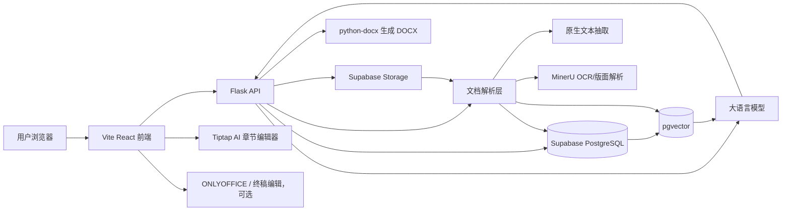
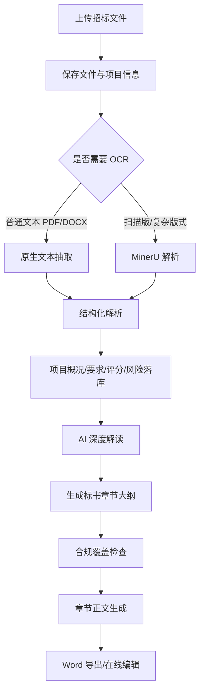
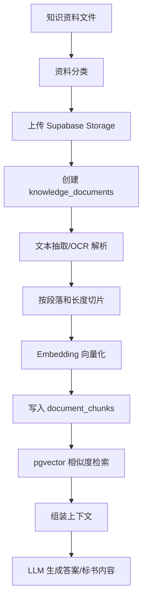
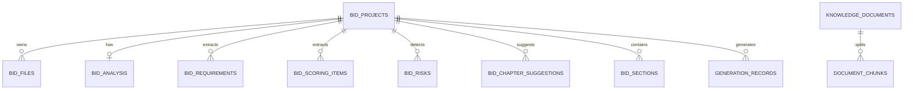

# AI 标书系统

面向招投标场景的 AI 标书编制系统。系统结合大语言模型、文档解析、RAG 企业知识库、章节生成、Word 导出和在线编辑能力，帮助用户完成招标文件解析、条款解读、风险识别、章节大纲生成、投标正文撰写和资料引用。

当前版本定位为 **单机部署 / 私有化部署 MVP**，适合企业内部试点、行业知识库验证和标书编制工作流探索。

## 功能概览

- 招标文件上传、解析和任务状态跟踪
- PDF / DOCX / Markdown 等资料解析与文本抽取
- MinerU OCR 解析接入，用于扫描版 PDF、表格和图片型招标文件
- 招标文件结构化解读：项目概况、资格要求、商务要求、技术要求、评分项、风险项
- AI 深度解读报告生成
- 标书章节大纲生成，支持技术标、商务标、资格文件、报价文件、附件材料等分册结构和多级章节树
- 合规覆盖检查：要求条款、评分项、风险项与标书章节的覆盖度核查
- 标书编制工作台：分册切换、章节树、目录模式、章节正文生成、章节维护
- 基于 Tiptap 的 AI 章节编辑器，支持标题、列表、表格和 AI 流式内容实时渲染
- 企业知识库 RAG 检索问答
- 系统设置：模型参数、企业画像、文档服务、存储路径和备份策略
- 水利行业种子知识库采集与入库脚本
- Word 文档生成与下载，支持完整投标文件和单独分册导出
- ONLYOFFICE 终稿编辑（可选）
- Supabase PostgreSQL + pgvector + Storage 数据底座

## 技术栈

### 后端

- Python 3.9+
- Flask / Flask-CORS
- Supabase Python SDK
- PostgreSQL / pgvector
- ChromaDB 本地向量库兼容层
- PyPDF2 / Mammoth / python-docx
- Pillow 图片处理，用于企业资信库和产品库缩略图生成
- MinerU API
- OpenAI-compatible SDK，用于调用通义千问等兼容模型服务

### 前端

- Vite
- React 18
- TypeScript
- Ant Design 5
- Tailwind CSS
- React Router
- TanStack Query
- Zustand
- Axios
- lucide-react
- Tiptap / ProseMirror（AI 章节编辑器）

### 存储与外部服务

- Supabase PostgreSQL：业务数据、结构化解析结果、知识库元数据
- Supabase Storage：招标文件、知识库文件、生成文档
- Supabase pgvector：RAG 向量检索
- DashScope / OpenAI-compatible LLM：文本生成、Embedding
- MinerU：复杂 PDF / OCR 解析
- ONLYOFFICE Docs：终稿在线编辑，可选（需 Docker 部署）

## 系统架构



## 核心业务流程



## 合规检查

招标项目页提供第一版合规覆盖检查，用于在生成章节大纲后快速判断投标文件是否承接了关键条款。

当前检查范围：

| 检查对象 | 核查逻辑 | 输出 |
| --- | --- | --- |
| 要求条款 | 将 `bid_requirements` 与 `bid_sections.mapped_requirements`、章节标题、章节正文做匹配 | 已覆盖 / 未覆盖 |
| 评分项 | 将 `bid_scoring_items` 与 `bid_sections.mapped_scoring_items`、章节内容做匹配 | 已覆盖 / 待补强 |
| 风险项 | 将 `bid_risks` 与 `bid_sections.mapped_risks`、章节内容做匹配 | 已覆盖 / 未覆盖 |

后端已提供统一接口：

```text
GET /api/bidding/interpretations/{project_id}/compliance-check
```

返回内容包括总检查项、已响应项、待补强项、未响应项、高风险未响应数量、明细列表和处理建议。该指标在界面中命名为“条款响应覆盖率”，用于追踪招标条款、评分项、风险项是否被当前章节映射或正文片段承接，不等同于最终 Word 标书合规结论。下载完整标书或分册前，系统会拉取最新条款响应报告；若仍存在未响应或高风险未响应项，会先弹窗提示风险，再由用户决定继续下载或返回补强。

## 技术标 / 商务标分册设计

系统当前采用轻量分册模型：暂不新增 `bid_volumes` 表，而是在章节大纲和 `bid_sections.metadata` 中记录分册归属。章节大纲生成会先判断本项目实际需要的投标文件组成，再输出 `volumes + chapters` 兼容结构。

面向真实投标用户，第一层工作区默认只展示 `技术标` 和 `商务标`。多数施工类招标文件会把资格资料、报价文件、附件材料纳入商务标或投标文件格式部分，因此系统内部仍保留 `qualification`、`price`、`attachment` 等细分类，但 UI 和商务标导出会把这些非技术章节聚合到商务标投标包里。

大纲结构：

```json
{
  "version": "ai-volume-v1",
  "volumes": [
    {
      "type": "technical",
      "name": "技术标",
      "required": true,
      "basis": "招标文件要求提交施工组织设计和技术响应文件",
      "chapters": []
    }
  ],
  "chapters": []
}
```

`volumes` 是业务分册结构，`chapters` 是全量扁平章节列表，用于兼容现有工作台、合规检查和 DOCX 导出链路。旧版只返回 `chapters` 的大纲仍可入库，后端会按章节标题、编写目标、响应点和资料需求推断分册。

当前分册类型：

| type | 名称 | 用途 |
| --- | --- | --- |
| `qualification` | 资格文件 | 营业执照、资质证书、人员证书、业绩和信誉声明 |
| `business` | 商务标 | 投标函、商务条款响应、偏离表、承诺函和合同响应 |
| `technical` | 技术标 | 施工组织设计、技术响应、质量安全环保、进度资源和设备方案 |
| `price` | 报价文件 | 工程量清单、投标报价、分项报价和单价分析 |
| `attachment` | 附件材料 | 图纸、证照扫描件、产品图片、业绩证明和其他附件 |
| `other` | 其他 | 未能自动归类的其他响应材料 |

每个 `bid_sections` 章节会写入：

```json
{
  "volume_type": "technical",
  "volume_name": "技术标",
  "document_role": "正文",
  "export_group": "技术标文件"
}
```

章节写作计划会优先读取 `metadata.volume_type`，再回退标题关键词推断，以便不同分册采用不同写作策略。

### 分册正文生成策略

正文生成会按 `metadata.volume_type` 注入分册策略、强制约束、资料召回侧重点和图片/附件策略。

| 分册 | 正文侧重点 | 强制约束 | 资料和图片策略 |
| --- | --- | --- | --- |
| 技术标 | 施工组织、技术方案、质量安全环保、进度资源、设备配置 | 设备参数、工艺指标、资源投入缺失时必须占位 | 优先召回施工方案、标准话术、产品库和设备/工艺图片，可自动插入相关图 |
| 商务标 | 投标函、合同条款响应、承诺函、偏离表、服务承诺 | 金额、日期、签章、保证金、保函编号不得编造，必须人工复核 | 优先召回商务条款、合同响应模板和承诺函；默认谨慎插图 |
| 资格文件 | 营业执照、资质证书、安全生产许可证、人员证书、业绩证明 | 证书编号、人员姓名、注册编号、业绩金额和日期不得编造 | 优先召回企业资信库和证照/业绩样张，插图必须标明脱敏或需替换 |
| 报价文件 | 报价口径、工程量清单、分项报价说明、税费和风险边界 | 禁止编造金额、单价、总价、税率和工程量 | 优先召回报价说明和风险提示；默认不自动插图 |
| 附件材料 | 附件清单、来源、适用章节、缺失状态和替换要求 | 不把附件清单写成正式事实证明 | 可按附件清单插入相关图片或证明样张，并标明来源 |

## RAG 知识库架构

系统使用 Supabase PostgreSQL + pgvector 作为企业知识库主链路。ChromaDB 仍保留为本地兼容能力，便于早期测试和离线验证。

### RAG 技术框架与模型

当前 RAG 知识库采用“Supabase 业务库 + pgvector 向量检索 + DashScope Embedding + LLM 流式问答”的实现方式。

| 层级 | 技术/模型 | 作用 |
| --- | --- | --- |
| 业务数据库 | Supabase PostgreSQL | 保存知识文档元数据、文档分片、解析状态和业务表 |
| 向量检索 | pgvector | 在 PostgreSQL 内保存 embedding 向量并执行相似度检索 |
| 对象存储 | Supabase Storage | 保存原始知识库文件、招标文件和生成文档 |
| 向量模型 | 默认 DashScope `text-embedding-v4`，维度默认 1024，可在系统设置中调整 | 将用户问题、知识分片和图片资产描述转换为向量 |
| Rerank 重排 | 默认 DashScope `qwen3-rerank`，可切换 `gte-rerank-v2`，系统设置可关闭 | 对 pgvector 初召回结果二次排序，提升水利术语、设备型号、资质名称匹配准确率 |
| 问答模型 | 默认 `qwen-long`，可在系统设置中调整 | 基于召回片段和企业图片资产生成最终回答 |
| 追问意图模型 | 默认读取 `knowledge_followup_model`，未配置时回退到系统文本模型 | 回答结束后识别用户下一步意图，生成 3 个业务追问 |
| 流式输出 | DashScope SSE / Flask `text/event-stream` | 支持 RAG 回答逐段返回，降低首屏等待体感 |
| 文本抽取 | PyPDF2 / Mammoth / Markdown 读取 | 处理普通 PDF、DOCX 和 Markdown 文档 |
| OCR/版面解析 | MinerU，可选 | 处理扫描版 PDF、复杂表格、图片型招标文件 |
| 图片预览 | Pillow + Supabase Storage | 上传企业资信/产品图片时生成 WebP 缩略图，详情预览优先加载缩略图，原图保留用于标书插图和下载 |
| 本地兼容向量库 | ChromaDB | 早期 MVP 兼容保留，主链路已转向 Supabase pgvector |

当前核心代码：

| 文件 | 说明 |
| --- | --- |
| `backend/rag/ingestion.py` | 上传知识库资料后的解析、图片上下文提取、embedding 和 `document_chunks` 写入 |
| `backend/rag/retrieval.py` | 用户问题向量化、调用 Supabase RPC 检索、组装 Prompt、生成 RAG 回答 |
| `rag_seed/water_resources/_scripts/ingest_water_rag_seed.py` | 水利行业种子资料批量入库脚本 |
| `backend/rag/vector_store.py` | DashScope embedding 封装与 ChromaDB 兼容逻辑 |
| `backend/api/routes.py` | `/api/knowledge/search`、`/api/knowledge/search/stream` 和 `/api/knowledge/followups` API |

RAG 检索链路：

```text
用户问题
→ 系统配置的 Embedding 模型生成 query embedding
→ Supabase RPC: match_knowledge_chunks
→ pgvector 相似度检索 document_chunks
→ Supabase RPC: match_knowledge_assets 检索企业资信/产品图片资产
→ 图片资产关键词兜底召回，覆盖营业执照、社保、业绩、产品图片等短文本资产
→ 召回 top-k 文档分片
→ 组装带来源信息和图片资产信息的 Prompt
→ 系统配置的知识库问答模型生成回答
→ SSE 流式返回答案
→ 前端展示答案、内联图片、参考资料来源
→ 回答完成后异步调用 /api/knowledge/followups 生成模型追问建议
```

追问建议链路：

```text
RAG 回答完成
→ 前端先基于规则生成兜底追问，保证用户立即可继续操作
→ 前端异步提交用户问题、AI 回答、召回资料、图片资产到 /api/knowledge/followups
→ 后端调用系统配置的追问意图模型
→ 模型输出固定 JSON: intent + followups
→ 后端兼容字符串 JSON 和 dict 两种模型返回格式，并做去重、长度和问号规范化
→ 前端用模型追问替换兜底追问；模型失败时保留规则兜底
```

分片与元数据策略：

- 文本分片默认按段落和长度切分，水利种子库入库脚本使用约 `1800` 字符的 chunk，并保留少量上下文重叠。
- 每个分片写入 `document_chunks.content`，向量写入 `document_chunks.embedding`。
- `document_chunks.metadata` 保存资料分类、文档类型、来源单位、原始 URL、文件路径、标签和 hash。
- 前端 RAG 回答完成后展示参考资料来源，帮助用户核对答案依据。
- 企业资信库、企业产品库上传的图片/附件写入 `knowledge_assets`，可通过向量召回和关键词兜底参与 RAG 问答。
- RAG 回答若提到 `图片资产1`、`图片资产2、3、4` 等编号，前端会自动把对应图片以 Markdown 图片形式插入到相应段落后，避免只输出文字描述。
- 图片预览优先加载缩略图，原图保留用于标书正文插图、附件查看和 DOCX 导出。

当前已验证的水利种子库入库结果：

- 有效资料：26 份
- 向量分片：558 条
- 分类：水利招标文件、水利政策法规、水利标准规范、水利标准话术
- 检索接口：`POST /api/knowledge/search`
- 流式检索接口：`POST /api/knowledge/search/stream`
- 追问建议接口：`POST /api/knowledge/followups`

### RAG 数据流



### RAG 资料分类

当前水利行业种子库使用以下分类：

| 分类 | 用途 |
| --- | --- |
| `water_tender_documents` | 公开招标公告、招标文件、施工/监理/设计类样本 |
| `water_policy_regulations` | 招投标、水利建设、质量、安全、验收、信用等法规 |
| `water_standards_specs` | 标准施工招标文件示范文本、标准规范目录 |
| `water_standard_phrases` | 自建投标话术、章节库、检查清单、施工组织设计模板 |

### RAG 入库脚本

水利行业种子资料位于：

```text
rag_seed/water_resources/
```

目录结构：

```text
rag_seed/water_resources/
├── 01_tender_documents/      # 公开招标文件与公告样本
├── 02_policy_regulations/    # 政策法规
├── 03_standards_specs/       # 标准规范目录与示范文本
├── 04_standard_phrases/      # 自建标准话术与章节模板
├── _scripts/
│   ├── download_water_rag_seed.py
│   └── ingest_water_rag_seed.py
├── index.csv
├── index.jsonl
└── README.md
```

重新下载公开资料：

```bash
python rag_seed/water_resources/_scripts/download_water_rag_seed.py
```

入库到 Supabase RAG 知识库：

```bash
python rag_seed/water_resources/_scripts/ingest_water_rag_seed.py
```

入库逻辑：

1. 读取 `index.csv`。
2. 只处理 `status=downloaded` 或 `status=generated` 的有效资料。
3. 跳过下载失败的 `.url.md` 占位文件。
4. 将原始文件上传到 Supabase Storage。
5. 写入 `knowledge_documents`。
6. 抽取文本并按段落切片。
7. 调用 Embedding 模型生成向量。
8. 写入 `document_chunks`。
9. 生成 `ingestion_report.md` 和 `ingestion_report.json`。

当前种子库已验证可入库：

- 有效资料：26 份
- 向量分片：558 条
- 检索链路：`search_knowledge_base()` 可正常召回水利行业资料

## 数据模型

核心表：

| 表 | 说明 |
| --- | --- |
| `bid_projects` | 招标项目主表 |
| `bid_files` | 招标文件元数据 |
| `bid_analysis` | 招标文件综合解析结果 |
| `bid_requirements` | 资格、商务、技术、文件要求 |
| `bid_scoring_items` | 评分项 |
| `bid_risks` | 风险项、否决项、废标项 |
| `bid_chapter_suggestions` | 建议响应章节 |
| `bid_sections` | 标书章节树与章节正文；通过 `metadata.volume_type`、`metadata.volume_name` 记录技术标、商务标、资格文件、报价文件等分册归属 |
| `knowledge_documents` | 企业知识库文档主表 |
| `document_chunks` | 文档切片、元数据与向量 |
| `generation_records` | AI 生成记录 |

ER 概览：



Storage bucket 建议：

| Bucket | 用途 | 建议权限 |
| --- | --- | --- |
| `tender-files` | 原始招标文件、补遗、答疑 | private |
| `generated-docx` | 生成的 Word / Markdown / 导出归档 | private |
| `knowledge-files` | 企业知识库资料、行业资料、历史标书 | private |
| `qualification-files` | 资质、证书、人员、财务等资料 | private |
| `product-files` | 产品手册、参数、图纸、案例材料 | private |

## 快速开始

### 1. 安装后端依赖

```bash
python -m venv venv
source venv/bin/activate
pip install -r requirements.txt
```

Windows:

```powershell
python -m venv venv
venv\Scripts\activate
pip install -r requirements.txt
```

### 2. 安装并构建前端

```bash
cd frontend
npm install
npm run build
cd ..
```

前端开发模式：

```bash
cd frontend
npm run dev
```

### 3. 配置环境变量

复制示例文件：

```bash
cp .env.example .env
```

如果项目暂未提供 `.env.example`，可参考以下配置创建 `.env`：

```ini
# LLM / Embedding
DASHSCOPE_API_KEY=your_dashscope_api_key
DASHSCOPE_MODEL=qwen-turbo-latest
DASHSCOPE_KNOWLEDGE_MODEL=qwen-long
DASHSCOPE_EMBEDDING_MODEL=text-embedding-v4
DASHSCOPE_EMBEDDING_DIMENSIONS=1024
DASHSCOPE_RERANK_ENABLED=true
DASHSCOPE_RERANK_MODEL=qwen3-rerank
DASHSCOPE_RERANK_TOP_N=6
DASHSCOPE_REQUEST_TIMEOUT_SECONDS=120
DASHSCOPE_STREAM_CONNECT_TIMEOUT_SECONDS=15
DASHSCOPE_STREAM_READ_TIMEOUT_SECONDS=180

# Supabase
SUPABASE_URL=https://your-project.supabase.co
SUPABASE_ANON_KEY=your_supabase_anon_key
SUPABASE_SERVICE_ROLE_KEY=your_supabase_service_role_key

SUPABASE_STORAGE_TENDER_BUCKET=tender-files
SUPABASE_STORAGE_GENERATED_BUCKET=generated-docx
SUPABASE_STORAGE_KNOWLEDGE_BUCKET=knowledge-files
SUPABASE_STORAGE_QUALIFICATION_BUCKET=qualification-files
SUPABASE_STORAGE_PRODUCT_BUCKET=product-files

# MinerU，可选
MINERU_API_TOKEN=your_mineru_api_token
MINERU_API_BASE_URL=https://mineru.net
MINERU_PARSE_PDF_FIRST=true

# App
APP_HOST=127.0.0.1:3012
APP_PUBLIC_BASE_URL=http://127.0.0.1:3012
MAX_UPLOAD_MB=200

# 企业画像，可选；也可在系统设置页面维护
ENTERPRISE_NAME=某水利工程建设企业
ENTERPRISE_REGION=华中地区
ENTERPRISE_INDUSTRY=水利水电工程建设与工程配套服务
ENTERPRISE_BUSINESS_SCOPE=水利工程施工、金属结构件、机电设备配套、质量检验、交付保障和现场服务
ENTERPRISE_ADVANTAGES=水利工程项目响应、质量安全管理、资料编制、供应链协同和现场履约能力
ENTERPRISE_TARGET_CUSTOMERS=水利工程建设单位、总承包单位、监理单位和设备供应链配套单位
ENTERPRISE_RESPONSE_STYLE=专业、严谨、合规、可落地；不得编造证书编号、人员姓名、合同金额、具体日期和未提供的企业业绩

# ONLYOFFICE，可选
ONLYOFFICE_DOCS_API_URL=http://127.0.0.1:8080/web-apps/apps/api/documents/api.js
ONLYOFFICE_JWT_SECRET=replace_with_a_strong_secret
```

模型、Embedding、超时时间、OnlyOffice 地址、存储目录和企业画像等非敏感配置也可以在「系统设置」页面调整。页面保存后会写入本地 `config/runtime_settings.json`，后端在下一次模型请求时读取该配置；该文件已加入 `.gitignore`，开源时只保留 `config/runtime_settings.example.json`。API Key、Supabase service role 等敏感项仍必须通过 `.env` 配置，不会保存在前端。

企业画像会参与招标解读、章节大纲、章节正文和旧版标书流程的 Prompt 组装。开源或更换企业使用时，建议先在系统设置中维护企业名称、行业定位、业务范围、核心能力、目标客户和 AI 写作约束，避免生成内容带有固定企业信息。

### 3.1 Supabase 补充表

当前上传链路已优先创建 Supabase 项目和文件记录，并返回 `projectId` 供前端自动执行「解析 → AI 解读 → 章节大纲」流程。轻量用户识别和 OnlyOffice 文档映射也已迁移到 Supabase，SQLite 仅作为兼容回退。

请在 Supabase SQL Editor 执行：

```sql
-- sql/20260429_app_users_and_onlyoffice_documents.sql
```

该脚本会创建：

| 表 | 用途 |
| --- | --- |
| `app_users` | 保存浏览器匿名指纹与单机版操作人员 ID，用于替代早期 SQLite `users` 表 |
| `onlyoffice_documents` | 保存 OnlyOffice 文档 key、项目 ID、文件路径和回调下载地址，用于保存回调定位目标文件 |

如果该脚本尚未执行，系统会尽量回退 SQLite；但推荐新部署直接执行 SQL，确保主链路统一到 Supabase。

### 4. 启动后端

```bash
python main.py
```

默认访问：

```text
http://127.0.0.1:3012
```

## 在线编辑器

### 主编辑器：Tiptap（默认）

标书编制工作台默认使用 Tiptap / ProseMirror 作为 AI 章节编辑器。

特点：
- 纯前端方案，无需 Docker 部署
- 内容保存仍采用 Markdown，便于 AI 生成、RAG 引用和 Word 导出
- AI 生成内容流式实时渲染，无延迟
- 支持标题、列表、表格、加粗、斜体、下划线等常用标书编辑能力
- 后续可扩展选中文字润色、续写、改写、资质图片插入和合规提示块

## 章节写作计划

标书章节不会只按目录层级固定生成固定字数。系统会在章节大纲生成阶段为每个 `bid_sections` 章节写入 `metadata.writing_plan`，用于指导目录模式展示和章节正文生成。

当前写作计划字段包括：

| 字段 | 说明 |
| --- | --- |
| `importance` | 章节重要性：`high` / `medium` / `low` |
| `target_words` | 目标字数，用于指导正文生成篇幅 |
| `min_words` / `max_words` | 建议字数区间 |
| `suggested_pages` | 建议页数区间，按标书常见排版估算 |
| `needs_table` | 是否建议插入表格 |
| `needs_image` | 是否建议插入图片、流程图或示意图 |
| `needs_qualification` | 是否需要资质、证书、营业执照等材料支撑 |
| `needs_case` | 是否需要类似项目业绩或案例支撑 |
| `generation_mode` | `single_pass` 或 `multi_pass`，长章节后续可分段续写 |
| `strategy` | 章节写作策略，参与正文生成 Prompt |

目录模式中：

- `目标 xxx字` 表示写作计划给出的目标篇幅。
- `已完成 xxx字` 表示当前章节正文去除空白后的实际字数。
- 核心章节、建议页数、需表格、需图文、需资质、需业绩等标签均来自写作计划。

如果旧数据没有 `metadata.writing_plan`，前端和后端会根据章节标题、层级、评分项、风险项和材料要求临时推导一份计划，避免历史项目无法生成正文。

### 终稿编辑：ONLYOFFICE（可选）

如需 Word 格式终稿编辑，可本地启动 ONLYOFFICE Document Server：

```bash
docker run -d \
  -p 8080:80 \
  --restart=always \
  -e JWT_SECRET=replace_with_a_strong_secret \
  onlyoffice/documentserver
```

注意：

- `JWT_SECRET` 必须与 `.env` 中 `ONLYOFFICE_JWT_SECRET` 一致。
- `APP_PUBLIC_BASE_URL` 必须是 ONLYOFFICE 容器能够访问到的后端地址。
- 如果仅使用 Tiptap 编辑 + Word 下载，可以不部署 ONLYOFFICE。

## 项目目录

```text
.
├── main.py                         # Flask 服务入口
├── backend/                        # 后端业务代码包
│   ├── api/                        # Flask API 路由与用户接口
│   │   ├── routes.py
│   │   └── users.py
│   ├── ai/                         # 大模型调用、解读、章节规划和正文生成
│   │   ├── qwen_client.py
│   │   ├── rerank_client.py
│   │   ├── interpreter.py
│   │   ├── chapter_planner.py
│   │   ├── section_writer.py
│   │   ├── bid_writing_plan.py
│   │   └── compliance_checker.py
│   ├── core/                       # 配置读取与通用工具
│   │   ├── config.py
│   │   └── llm_json_utils.py
│   ├── db/                         # Supabase 客户端与业务数据访问层
│   │   ├── supabase_client.py
│   │   └── supabase_repo.py
│   ├── parsing/                    # MinerU/OCR、招标文件解析和结构化解读
│   │   ├── document_parser.py
│   │   ├── mineru_client.py
│   │   └── bid_interpreter.py
│   ├── rag/                        # 知识库入库、向量化、检索与 RAG 问答
│   │   ├── ingestion.py
│   │   ├── retrieval.py
│   │   └── vector_store.py
│   └── export/                     # DOCX / Word 导出
│       └── md_to_word.py
├── frontend/                       # Vite + React 前端
├── sql/                            # 数据库 SQL
├── rag_seed/water_resources/       # 水利行业 RAG 种子资料
├── parsed_outputs/                 # 文档解析产物，建议加入 .gitignore
├── uploads/                        # 上传文件，建议加入 .gitignore
└── outputs/                        # 生成文件，建议加入 .gitignore
```

## API 概览

主要接口前缀：

```text
/api/bidding/*
/api/knowledge/*
/api/outputs/*
/api/users/*
```

常用接口：

| 接口 | 说明 |
| --- | --- |
| `POST /api/bidding/upload` | 上传招标文件 |
| `GET /api/bidding/parse-status/<file_id>` | 查询解析状态 |
| `GET /api/bidding/interpretations/latest` | 获取最近的招标解读 |
| `GET /api/bidding/interpretations/<project_id>` | 获取项目解读 |
| `POST /api/bidding/interpretations/<project_id>/ai-report` | 生成 AI 深度解读 |
| `POST /api/bidding/interpretations/<project_id>/bid-outline` | 生成分册化章节大纲，返回 `volumes + chapters` |
| `GET /api/bidding/interpretations/<project_id>/bid-outline/stream` | SSE 流式生成分册化章节大纲 |
| `POST /api/bidding/interpretations/<project_id>/sections/stream` | 流式生成章节正文 |
| `POST /api/bidding/interpretations/<project_id>/download-docx` | 生成 DOCX；可传 `volumeType` 单独导出技术标或商务标 |
| `POST /api/knowledge/upload` | 上传知识库资料 |
| `POST /api/knowledge/search` | RAG 检索问答 |
| `POST /api/knowledge/search/stream` | SSE 流式 RAG 检索问答 |
| `POST /api/knowledge/followups` | 基于用户问题、回答、资料和图片资产生成模型追问建议 |
| `GET /api/knowledge/documents` | 查询知识库文档列表 |

分册导出示例：

```json
{
  "volumeType": "technical",
  "withImages": true
}
```

不传 `volumeType` 时导出完整投标文件；传入 `technical` 时导出技术标；传入 `business` 时导出商务标，并自动包含内部的商务响应、资格文件、报价文件、附件材料和其他非技术章节。导出的 DOCX 文件名、文档标题和页眉保留中文项目名与分册名；正式正文会清理 emoji、图钉、告警图标等装饰性符号，只保留纯文字提醒。

## 安全与开源注意事项

请不要提交以下内容：

- `.env`
- Supabase service role key
- LLM API key
- MinerU token
- ONLYOFFICE JWT secret
- 客户真实招标文件、资质文件、报价文件
- `uploads/`、`outputs/`、`parsed_outputs/` 中的业务文件
- 本地数据库、向量库、缓存和日志

建议在开源仓库中提供：

- `.env.example`
- 脱敏的演示数据
- 可公开下载的种子资料脚本
- 最小可运行 SQL
- Docker Compose 示例
- API 文档或 OpenAPI 文件

## 当前限制

- PDF 解析质量取决于文件类型。扫描版、图片型、复杂表格建议走 MinerU/OCR。
- 水利行业种子库目前适合作为基础 RAG，不等同于完整行业知识库。
- 企业资质、人员、业绩、产品、财务等私有资料需要用户自行入库。
- Tiptap 编辑器当前为基础版本，后续可扩展 AI 辅助编辑（续写、润色、改写）和资料引用块。
- ONLYOFFICE 为可选终稿编辑能力，不影响 Tiptap 编辑 + Word 下载主链路。
- 当前仍保留部分 ChromaDB 本地兼容代码，后续可逐步收敛到 Supabase pgvector。

## 下一步路线图

本路线图综合两份外部评审报告形成：一份偏工程治理与安全审计，一份偏产品能力与业务价值评估。综合判断是：当前系统已经具备水利招投标单机版 MVP 的核心业务闭环，但如果要开源、产品化或进入真实企业长期使用，需要优先补齐安全、稳定性、测试和可维护性。

### 评审共识

- 当前业务链路完整：招标文件上传、MinerU/OCR 解析、结构化解读、AI 深度解读、章节大纲、章节正文生成、目录模式、Tiptap 编辑、RAG 问答、DOCX 导出已经形成闭环。
- `backend/ai/bid_writing_plan.py` 的章节写作计划是核心产品能力之一，能够根据章节类型、重要性、评分项、风险项和材料要求动态规划字数、页数、图表、资质和案例支撑。
- RAG 当前已具备 pgvector 向量召回和 DashScope Rerank 重排，后续需要继续补混合检索、来源引用和行业资料扩展。
- 条款响应检查当前是轻量规则版，适合发现漏项和下载前风险提醒，但还不能替代人工或大模型语义复核。
- Tiptap 已经适合作为主编辑器，后续应增强 AI 伴写能力，而不是继续依赖复杂的外部在线 Office 作为主链路。
- 代码已经进入需要治理的阶段，后端已完成基础分包，但 `backend/api/routes.py` 和前端 `BidEditor` 体量仍较大，应继续拆分并补测试。

### 需要修正的评审结论

- “已达到生产级”这一判断偏乐观。当前更准确的定位是：适合单机版、私有化试点和 MVP 验证，尚未达到公网生产部署标准。
- “模型服务支持 Qwen、Claude”这一表述不严谨。当前主链路是 DashScope/Qwen，其他模型提供商需要后续适配。
- “网络请求普遍具备重试机制”不完全准确。图片下载和部分文档处理已有超时保护，但大模型调用、Supabase 写入和批量任务仍需要系统化重试、退避和幂等设计。
- “代码结构可维护性良好”偏乐观。当前后端已按功能迁移到 `backend/` 包，但部分核心模块仍偏大，继续迭代前应进一步细分。
- “安全问题在单机版影响较小”只适用于本机试用。一旦开源、内网多人使用或部署到公网，认证、CORS、密钥、错误脱敏和上传校验必须优先处理。

### P0：开源与安全最小闭环

- [ ] 提供完整 `.env.example`，覆盖 Supabase、DashScope、MinerU、OnlyOffice、存储路径和超时时间。
- [ ] 移除所有默认弱密钥，尤其是 `ONLYOFFICE_JWT_SECRET`，启动时检查生产环境必填配置。
- [ ] 增加基础认证或本地访问保护开关，至少保护系统设置、上传、解析、生成、知识库和文件下载接口。
- [ ] 将 `CORS(app)` 改为环境变量配置的白名单。
- [ ] 后端错误信息脱敏，避免直接向前端返回 `str(e)` 中的密钥、路径、SQL 或外部服务响应。
- [ ] 清理调试 `print` 和敏感日志，统一使用结构化 logging。
- [ ] 增加上传文件白名单、大小限制、MIME 校验和异常文件处理策略。
- [ ] 开源前移除真实业务文件、生成文件、解析产物、缓存、日志和本地运行配置。

### P1：稳定性与任务可靠性

- [ ] 为 DashScope/Qwen 调用增加重试、指数退避、限流提示和可配置超时。
- [ ] 为 Supabase 写入增加幂等设计，重点覆盖章节保存、批量排序、批量生成状态更新和知识库入库。
- [ ] 将批量章节生成状态从前端内存态逐步迁移为后端任务态，支持刷新页面后恢复进度。
- [x] 历史记录已合并 Supabase 文件状态与本地 MinerU 状态文件，支持展示解析中、解析失败、失败原因和解析任务 ID。
- [x] 历史记录支持失败任务重试解析：优先复用本地上传文件，不存在时从 Supabase Storage 拉取原文件，生成新的 `parse_id` 后重新进入 MinerU/OCR 解析链路。
- [x] 历史记录页对解析中任务进行自动刷新，用户离开首页后再返回也能追踪解析进度。
- [ ] 单章生成失败时保留上一次成功正文或用户编辑稿，避免误清空有效内容。
- [ ] DOCX 导出增加任务化处理，长文档和图文并茂导出可轮询状态，避免 HTTP 请求超时。
- [ ] 图文并茂导出增加图片命中解释、插图数量上限、图片下载失败降级和引用来源记录。
- [ ] MinerU 下载、解析、导入继续保留断点重试和失败原因展示。

### P2：工程结构治理

- [x] 后端根目录 Python 文件已按功能迁移到 `backend/api`、`backend/ai`、`backend/core`、`backend/db`、`backend/parsing`、`backend/rag`、`backend/export`，根目录仅保留 `main.py` 作为 Flask 启动入口。
- [ ] 继续拆分 `backend/api/routes.py`：项目/文件、MinerU 解析、招标解读、章节大纲、章节正文、知识库、系统设置、DOCX 导出分别成模块。
- [ ] 拆分 `frontend/src/pages/BidEditor/index.tsx`：章节树、目录模式、正文编辑器、批量生成、下载、状态管理拆成组件和 hooks。
- [ ] 收敛历史兼容代码，逐步移除不再作为主链路的旧版 Chroma/OnlyOffice/Milkdown 逻辑。
- [ ] 减少前端 `any`，补充核心 API 类型和章节数据类型。
- [ ] 将系统设置、模型配置、企业画像、写作策略统一为明确的配置读取链路，避免硬编码。
- [ ] 整理完整 Supabase 初始化 SQL / migration。
- [ ] 增加 OpenAPI 文档。
- [ ] 增加 Docker Compose 一键启动。

### P3：测试与质量保障

- [ ] 增加后端 smoke test：健康检查、上传、解析状态、项目查询、章节生成、DOCX 下载。
- [ ] 增加 RAG 检索测试：文本召回、图片资产召回、无关问题拒答、来源展示。
- [ ] 增加 DOCX 导出回归测试：标题层级、表格、页眉、中文字体、图片插入、Markdown 符号清理。
- [ ] 增加前端关键流程测试：上传招标文件、生成大纲、单章生成、批量生成、目录模式、重置状态。
- [ ] 增加 CI：后端语法检查、前端 build、基础测试、README 链接和 SQL 文件检查。

### P4：RAG 与行业知识库增强

- [ ] 增加混合检索：关键词 BM25 / 全文检索 + pgvector 向量检索。
- [x] 接入 Rerank 模型，对水利专有名词、设备型号、资质名称和评分条款进行重排。
- [ ] 增加章节正文引用来源标注，支持用户追溯每段正文来自哪些招标条款或知识库资料。
- [ ] 扩充水利行业种子库到更多工程类型：水库除险加固、泵站、河道治理、灌区、堤防、水闸、水电站、信息化监测等。
- [ ] 完善企业知识库批量导入 UI，支持资料分类、标签、解析状态、失败重试和批量删除。
- [ ] 增强图片和资质资产库：产品图、设备图、施工现场图、流程图、资质证书脱敏示意图、营业执照脱敏示意图。

### P5：标书核心能力增强

- [x] 章节大纲生成已升级为轻量分册模型：AI Prompt 输出 `volumes`，规则 fallback 输出 `volumes`，同时保留扁平 `chapters` 兼容现有工作台。
- [x] 分册正文生成策略已接入：技术标、商务标、资格文件、报价文件和附件材料分别注入不同写作约束、资料召回侧重点和图片策略。
- [ ] 分册模型稳定后新增正式 `bid_volumes` 表，承载分册状态、顺序、完成率、风险数量和用户自定义分册名称。
- [ ] 将合规检查升级为 LLM 语义复核：逐条检查要求项、评分项、风险项是否被正文实质响应。
- [ ] 增加评分点覆盖报告，按评分项输出“已覆盖 / 待补强 / 高风险缺失”。
- [ ] 增加 AI 伴写能力：选中文字润色、扩写、缩写、改写为更正式、补充证明材料、生成表格。
- [ ] 增加长上下文管理：章节摘要、历史章节压缩、相邻章节引用，降低多章生成时的上下文污染。
- [ ] 增加版本管理：单章生成版本、人工编辑版本、导出版本和回滚。
- [ ] 增强 DOCX 国标化模板：页眉页脚、目录、标题样式、正文宋体/仿宋、行距、页边距、表格样式和自动分页。

### 已完成关键任务

- [x] 提供 Supabase 补充 SQL：`app_users`、`onlyoffice_documents`
- [x] 集成 Tiptap AI 章节编辑器，替换 Milkdown 为主编辑方案
- [x] 增加章节写作计划：目标字数、建议页数、章节重要性和材料支撑策略
- [x] 优化标书目录生成交互：单章重写跳转正文编辑区，一键编写全文保留目录模式并显示批量进度
- [x] 增加章节生成状态重置能力
- [x] 增加图文并茂 DOCX 导出基础能力
- [x] 企业资信库和产品库图片上传支持原图 + WebP 缩略图双文件策略，详情预览优先加载缩略图，点击放大再读取原图

## License

请根据实际开源计划补充许可证。若暂未确定，建议先不要公开发布为可商用许可证。
