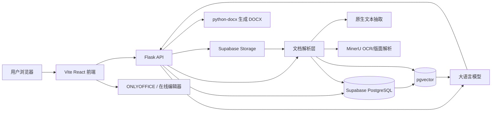
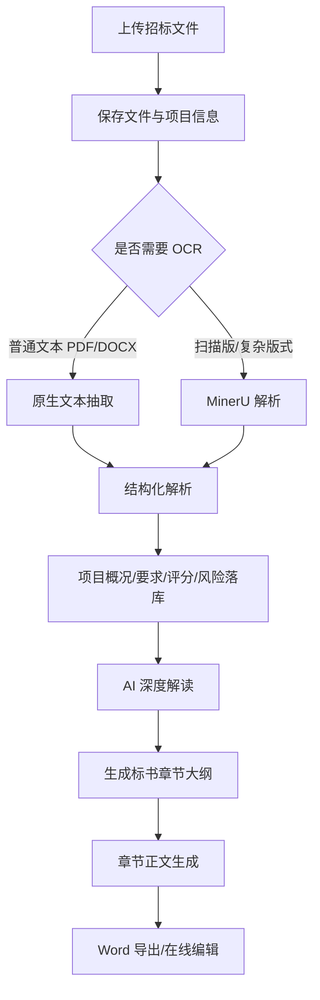
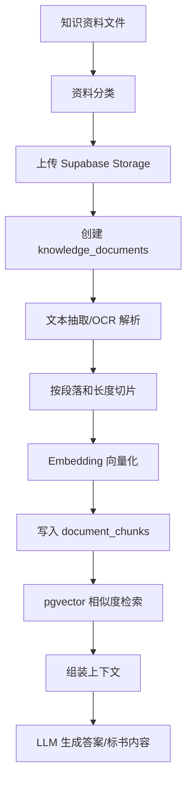
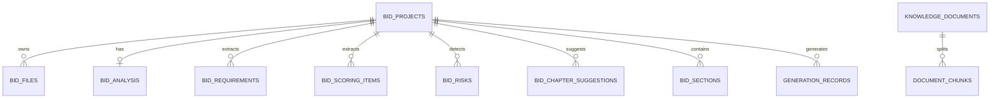

# AI 标书系统

面向招投标场景的 AI 标书编制系统。系统结合大语言模型、文档解析、RAG 企业知识库、章节生成、Word 导出和在线编辑能力，帮助用户完成招标文件解析、条款解读、风险识别、章节大纲生成、投标正文撰写和资料引用。

当前版本定位为 **单机部署 / 私有化部署 MVP**，适合企业内部试点、行业知识库验证和标书编制工作流探索。

## 功能概览

- 招标文件上传、解析和任务状态跟踪
- PDF / DOCX / Markdown 等资料解析与文本抽取
- MinerU OCR 解析接入，用于扫描版 PDF、表格和图片型招标文件
- 招标文件结构化解读：项目概况、资格要求、商务要求、技术要求、评分项、风险项
- AI 深度解读报告生成
- 标书章节大纲生成，支持多级章节树
- 标书编制工作台：章节树、目录模式、章节正文生成、章节维护
- 企业知识库 RAG 检索问答
- 水利行业种子知识库采集与入库脚本
- Word 文档生成与下载
- ONLYOFFICE 终稿编辑集成预留
- Supabase PostgreSQL + pgvector + Storage 数据底座

## 技术栈

### 后端

- Python 3.9+
- Flask / Flask-CORS
- Supabase Python SDK
- PostgreSQL / pgvector
- ChromaDB 本地向量库兼容层
- PyPDF2 / Mammoth / python-docx
- MinerU API
- OpenAI-compatible SDK，用于调用通义千问等兼容模型服务

### 前端

- Vite
- React 18
- TypeScript
- Ant Design 5
- Tailwind CSS
- React Router
- TanStack Query
- Zustand
- Axios
- lucide-react

### 存储与外部服务

- Supabase PostgreSQL：业务数据、结构化解析结果、知识库元数据
- Supabase Storage：招标文件、知识库文件、生成文档
- Supabase pgvector：RAG 向量检索
- DashScope / OpenAI-compatible LLM：文本生成、Embedding
- MinerU：复杂 PDF / OCR 解析
- ONLYOFFICE Docs：终稿在线编辑，可选

## 系统架构



## 核心业务流程



## RAG 知识库架构

系统使用 Supabase PostgreSQL + pgvector 作为企业知识库主链路。ChromaDB 仍保留为本地兼容能力，便于早期测试和离线验证。

### RAG 技术框架与模型

当前 RAG 知识库采用“Supabase 业务库 + pgvector 向量检索 + DashScope Embedding + LLM 流式问答”的实现方式。

| 层级 | 技术/模型 | 作用 |
| --- | --- | --- |
| 业务数据库 | Supabase PostgreSQL | 保存知识文档元数据、文档分片、解析状态和业务表 |
| 向量检索 | pgvector | 在 PostgreSQL 内保存 embedding 向量并执行相似度检索 |
| 对象存储 | Supabase Storage | 保存原始知识库文件、招标文件和生成文档 |
| 向量模型 | DashScope `text-embedding-v3` | 将用户问题和知识分片转换为向量 |
| 问答模型 | DashScope / OpenAI-compatible Chat Model，默认使用 `qwen-long` 做知识库回答 | 基于召回片段生成最终回答 |
| 流式输出 | DashScope SSE / Flask `text/event-stream` | 支持 RAG 回答逐段返回，降低首屏等待体感 |
| 文本抽取 | PyPDF2 / Mammoth / Markdown 读取 | 处理普通 PDF、DOCX 和 Markdown 文档 |
| OCR/版面解析 | MinerU，可选 | 处理扫描版 PDF、复杂表格、图片型招标文件 |
| 本地兼容向量库 | ChromaDB | 早期 MVP 兼容保留，主链路已转向 Supabase pgvector |

当前核心代码：

| 文件 | 说明 |
| --- | --- |
| `knowledge_ingestion.py` | 上传知识库资料后的解析、图片上下文提取、embedding 和 `document_chunks` 写入 |
| `knowledge_retrieval.py` | 用户问题向量化、调用 Supabase RPC 检索、组装 Prompt、生成 RAG 回答 |
| `rag_seed/water_resources/_scripts/ingest_water_rag_seed.py` | 水利行业种子资料批量入库脚本 |
| `file_to_chroma.py` | DashScope embedding 封装与 ChromaDB 兼容逻辑 |
| `routes.py` | `/api/knowledge/search` 和 `/api/knowledge/search/stream` API |

RAG 检索链路：

```text
用户问题
→ text-embedding-v3 生成 query embedding
→ Supabase RPC: match_knowledge_chunks
→ pgvector 相似度检索 document_chunks
→ 召回 top-k 文档分片
→ 组装带来源信息的 Prompt
→ qwen-long / 兼容模型生成回答
→ SSE 流式返回答案
→ 前端展示答案与参考资料来源
```

分片与元数据策略：

- 文本分片默认按段落和长度切分，水利种子库入库脚本使用约 `1800` 字符的 chunk，并保留少量上下文重叠。
- 每个分片写入 `document_chunks.content`，向量写入 `document_chunks.embedding`。
- `document_chunks.metadata` 保存资料分类、文档类型、来源单位、原始 URL、文件路径、标签和 hash。
- 前端 RAG 回答完成后展示参考资料来源，帮助用户核对答案依据。
- 当前水利种子库主要是文本 RAG；图片召回能力保留在 `knowledge_ingestion.py` 的图文节点逻辑中，需上传图文资料并完成 MinerU 解析后使用。

当前已验证的水利种子库入库结果：

- 有效资料：26 份
- 向量分片：558 条
- 分类：水利招标文件、水利政策法规、水利标准规范、水利标准话术
- 检索接口：`POST /api/knowledge/search`
- 流式检索接口：`POST /api/knowledge/search/stream`

### RAG 数据流



### RAG 资料分类

当前水利行业种子库使用以下分类：

| 分类 | 用途 |
| --- | --- |
| `water_tender_documents` | 公开招标公告、招标文件、施工/监理/设计类样本 |
| `water_policy_regulations` | 招投标、水利建设、质量、安全、验收、信用等法规 |
| `water_standards_specs` | 标准施工招标文件示范文本、标准规范目录 |
| `water_standard_phrases` | 自建投标话术、章节库、检查清单、施工组织设计模板 |

### RAG 入库脚本

水利行业种子资料位于：

```text
rag_seed/water_resources/
```

目录结构：

```text
rag_seed/water_resources/
├── 01_tender_documents/      # 公开招标文件与公告样本
├── 02_policy_regulations/    # 政策法规
├── 03_standards_specs/       # 标准规范目录与示范文本
├── 04_standard_phrases/      # 自建标准话术与章节模板
├── _scripts/
│   ├── download_water_rag_seed.py
│   └── ingest_water_rag_seed.py
├── index.csv
├── index.jsonl
└── README.md
```

重新下载公开资料：

```bash
python rag_seed/water_resources/_scripts/download_water_rag_seed.py
```

入库到 Supabase RAG 知识库：

```bash
python rag_seed/water_resources/_scripts/ingest_water_rag_seed.py
```

入库逻辑：

1. 读取 `index.csv`。
2. 只处理 `status=downloaded` 或 `status=generated` 的有效资料。
3. 跳过下载失败的 `.url.md` 占位文件。
4. 将原始文件上传到 Supabase Storage。
5. 写入 `knowledge_documents`。
6. 抽取文本并按段落切片。
7. 调用 Embedding 模型生成向量。
8. 写入 `document_chunks`。
9. 生成 `ingestion_report.md` 和 `ingestion_report.json`。

当前种子库已验证可入库：

- 有效资料：26 份
- 向量分片：558 条
- 检索链路：`search_knowledge_base()` 可正常召回水利行业资料

## 数据模型

核心表：

| 表 | 说明 |
| --- | --- |
| `bid_projects` | 招标项目主表 |
| `bid_files` | 招标文件元数据 |
| `bid_analysis` | 招标文件综合解析结果 |
| `bid_requirements` | 资格、商务、技术、文件要求 |
| `bid_scoring_items` | 评分项 |
| `bid_risks` | 风险项、否决项、废标项 |
| `bid_chapter_suggestions` | 建议响应章节 |
| `bid_sections` | 标书章节树与章节正文 |
| `knowledge_documents` | 企业知识库文档主表 |
| `document_chunks` | 文档切片、元数据与向量 |
| `generation_records` | AI 生成记录 |

ER 概览：



Storage bucket 建议：

| Bucket | 用途 | 建议权限 |
| --- | --- | --- |
| `tender-files` | 原始招标文件、补遗、答疑 | private |
| `generated-docx` | 生成的 Word / Markdown / 导出归档 | private |
| `knowledge-files` | 企业知识库资料、行业资料、历史标书 | private |
| `qualification-files` | 资质、证书、人员、财务等资料 | private |
| `product-files` | 产品手册、参数、图纸、案例材料 | private |

## 快速开始

### 1. 安装后端依赖

```bash
python -m venv venv
source venv/bin/activate
pip install -r requirements.txt
```

Windows:

```powershell
python -m venv venv
venv\Scripts\activate
pip install -r requirements.txt
```

### 2. 安装并构建前端

```bash
cd frontend
npm install
npm run build
cd ..
```

前端开发模式：

```bash
cd frontend
npm run dev
```

### 3. 配置环境变量

复制示例文件：

```bash
cp .env.example .env
```

如果项目暂未提供 `.env.example`，可参考以下配置创建 `.env`：

```ini
# LLM / Embedding
DASHSCOPE_API_KEY=your_dashscope_api_key

# Supabase
SUPABASE_URL=https://your-project.supabase.co
SUPABASE_ANON_KEY=your_supabase_anon_key
SUPABASE_SERVICE_ROLE_KEY=your_supabase_service_role_key

SUPABASE_STORAGE_TENDER_BUCKET=tender-files
SUPABASE_STORAGE_GENERATED_BUCKET=generated-docx
SUPABASE_STORAGE_KNOWLEDGE_BUCKET=knowledge-files
SUPABASE_STORAGE_QUALIFICATION_BUCKET=qualification-files
SUPABASE_STORAGE_PRODUCT_BUCKET=product-files

# MinerU，可选
MINERU_API_TOKEN=your_mineru_api_token
MINERU_API_BASE_URL=https://mineru.net
MINERU_PARSE_PDF_FIRST=true

# App
APP_HOST=127.0.0.1:3012
APP_PUBLIC_BASE_URL=http://127.0.0.1:3012
MAX_UPLOAD_MB=200

# ONLYOFFICE，可选
ONLYOFFICE_DOCS_API_URL=http://127.0.0.1:8080/web-apps/apps/api/documents/api.js
ONLYOFFICE_JWT_SECRET=replace_with_a_strong_secret
```

### 4. 启动后端

```bash
python main.py
```

默认访问：

```text
http://127.0.0.1:3012
```

## ONLYOFFICE 可选部署

如需在线终稿编辑，可本地启动 ONLYOFFICE Document Server：

```bash
docker run -d \
  -p 8080:80 \
  --restart=always \
  -e JWT_SECRET=replace_with_a_strong_secret \
  onlyoffice/documentserver
```

注意：

- `JWT_SECRET` 必须与 `.env` 中 `ONLYOFFICE_JWT_SECRET` 一致。
- `APP_PUBLIC_BASE_URL` 必须是 ONLYOFFICE 容器能够访问到的后端地址。
- 如果仅使用 Word 下载，可以不部署 ONLYOFFICE。

## 项目目录

```text
.
├── main.py                         # Flask 服务入口
├── routes.py                       # API 路由
├── db_supabase.py                  # Supabase 业务数据封装
├── supabase_client.py              # Supabase client 与 Storage 封装
├── document_parser.py              # 招标文件解析入口
├── mineru_client.py                # MinerU API 封装
├── bid_interpreter.py              # 招标文件结构化解读
├── ai_interpreter.py               # AI 深度解读
├── ai_chapter_planner.py           # 章节大纲生成
├── ai_section_writer.py            # 单章节正文生成
├── knowledge_ingestion.py          # 企业知识库入库逻辑
├── knowledge_retrieval.py          # RAG 检索与问答
├── file_to_chroma.py               # 本地 Chroma 兼容向量库
├── md_to_word.py                   # Markdown / 章节内容转 DOCX
├── frontend/                       # Vite + React 前端
├── sql/                            # 数据库 SQL
├── rag_seed/water_resources/       # 水利行业 RAG 种子资料
├── parsed_outputs/                 # 文档解析产物，建议加入 .gitignore
├── uploads/                        # 上传文件，建议加入 .gitignore
└── outputs/                        # 生成文件，建议加入 .gitignore
```

## API 概览

主要接口前缀：

```text
/api/bidding/*
/api/knowledge/*
/api/outputs/*
/api/users/*
```

常用接口：

| 接口 | 说明 |
| --- | --- |
| `POST /api/bidding/upload` | 上传招标文件 |
| `GET /api/bidding/parse-status/<file_id>` | 查询解析状态 |
| `GET /api/bidding/interpretations/latest` | 获取最近的招标解读 |
| `GET /api/bidding/interpretations/<project_id>` | 获取项目解读 |
| `POST /api/bidding/interpretations/<project_id>/ai-report` | 生成 AI 深度解读 |
| `POST /api/bidding/interpretations/<project_id>/bid-outline` | 生成章节大纲 |
| `GET /api/bidding/interpretations/<project_id>/bid-outline/stream` | SSE 流式生成章节大纲 |
| `POST /api/bidding/interpretations/<project_id>/sections/stream` | 流式生成章节正文 |
| `POST /api/knowledge/upload` | 上传知识库资料 |
| `POST /api/knowledge/search` | RAG 检索问答 |
| `GET /api/knowledge/documents` | 查询知识库文档列表 |

## 安全与开源注意事项

请不要提交以下内容：

- `.env`
- Supabase service role key
- LLM API key
- MinerU token
- ONLYOFFICE JWT secret
- 客户真实招标文件、资质文件、报价文件
- `uploads/`、`outputs/`、`parsed_outputs/` 中的业务文件
- 本地数据库、向量库、缓存和日志

建议在开源仓库中提供：

- `.env.example`
- 脱敏的演示数据
- 可公开下载的种子资料脚本
- 最小可运行 SQL
- Docker Compose 示例
- API 文档或 OpenAPI 文件

## 当前限制

- PDF 解析质量取决于文件类型。扫描版、图片型、复杂表格建议走 MinerU/OCR。
- 水利行业种子库目前适合作为基础 RAG，不等同于完整行业知识库。
- 企业资质、人员、业绩、产品、财务等私有资料需要用户自行入库。
- ONLYOFFICE 为可选终稿编辑能力，不影响 Word 下载主链路。
- 当前仍保留部分 ChromaDB 本地兼容代码，后续可逐步收敛到 Supabase pgvector。

## 路线图

- [ ] 提供完整 `.env.example`
- [ ] 提供 Supabase 初始化 SQL / migration
- [ ] 增加 OpenAPI 文档
- [ ] 增加 Docker Compose 一键启动
- [ ] 完善企业知识库批量导入 UI
- [ ] 增加混合检索：关键词 + 向量 + rerank
- [ ] 增加章节正文引用来源标注
- [ ] 增加投标文件合规检查与评分覆盖检查
- [ ] 扩充水利行业种子库到更多工程类型
- [ ] 增加自动化测试和 CI

## License

请根据实际开源计划补充许可证。若暂未确定，建议先不要公开发布为可商用许可证。
